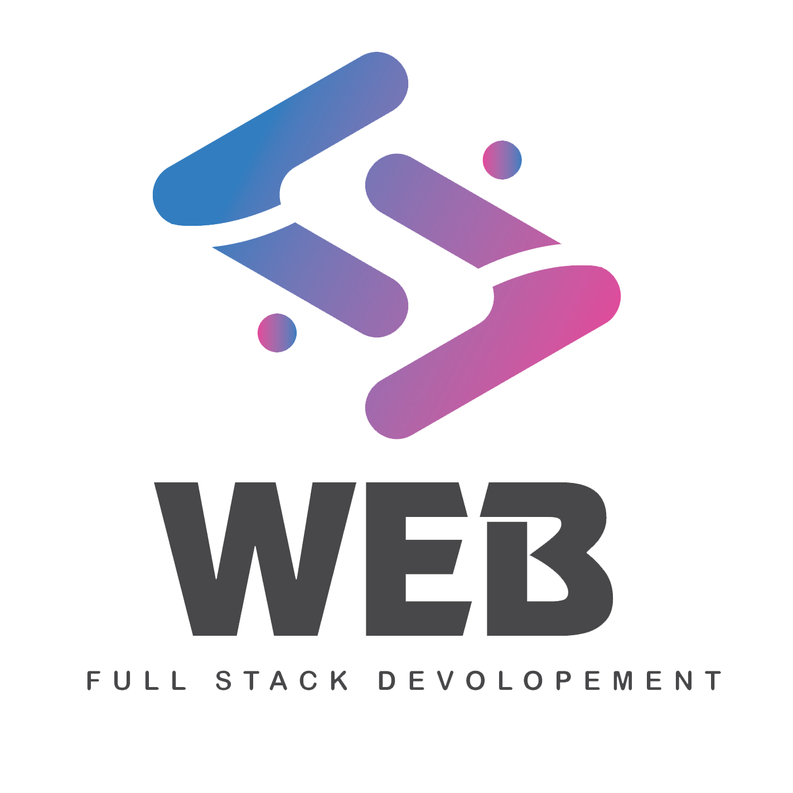
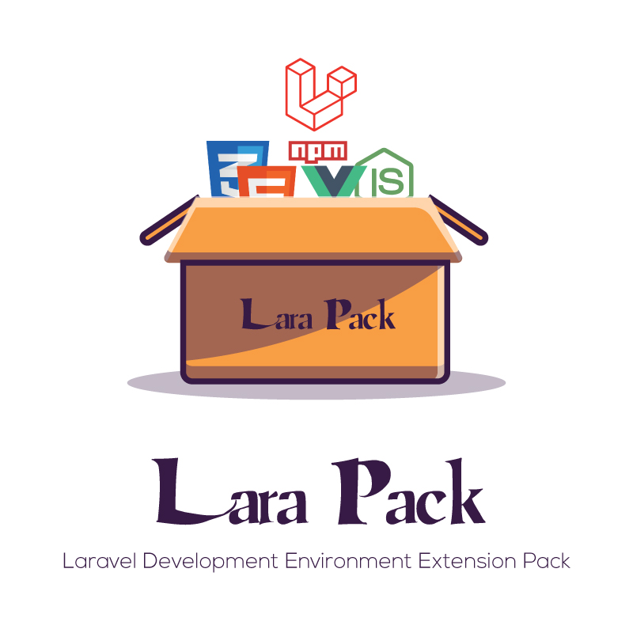

<p align="center">



</p>

<p><br></p>

## Full Stack Developers Extension Pack

---

<p><a title="IQBAL HASAN" href="https://iqbalhasan.dev">Full Stack Developers Extension Pack</a> is a Official VS Code Full Stack Development Environment Extension Pack By <a title="IQBAL HASAN"  href="https://iqbalhasan.dev">IQBAL HASAN</a>!  Full Stack Developers Extension Pack is made with all the extensions required by Full Stack Developers.This pack has the extension of all the languages: HTML, CSS, JS, VUE, GIT, GITHUB, PHP, LARAVEL, AXIOS etc.</p>

---

## Getting started

You can install this awesome theme through the [Visual Studio Code Marketplace](https://marketplace.visualstudio.com/items?itemName=iqbalhasandev.full-stack-development-extension-pack).

### Prerequisites

This theme is compatible for VS Code version 1.56.0+

### Installation

Launch _Quick Open_:

-  <a href="https://code.visualstudio.com/shortcuts/keyboard-shortcuts-linux.pdf">Linux</a> `Ctrl+P`
-  <a href="https://code.visualstudio.com/shortcuts/keyboard-shortcuts-macos.pdf">macOS</a> `⌘P`
-  <a href="https://code.visualstudio.com/shortcuts/keyboard-shortcuts-windows.pdf">Windows</a> `Ctrl+P`

## To install

Paste the following command in terminal and press `Enter`:

```shell
code --install-extension iqbalhasandev.full-stack-development-extension-pack
```

## To uninstall

Paste the following command in terminal and press `Enter`:

```shell
code --uninstall-extension iqbalhasandev.full-stack-development-extension-pack
```

---

## Extensions Included

By installing Full Stack Developers Extension Pack, the following extensions are installed:

<!-- Lara Pack -->

- [📦 Lara Pack ](https://marketplace.visualstudio.com/items?itemName=iqbalhasandev.lara-pack)

  - Lara Pack is a Official VS Code Laravel Development Environment Extension Pack By IQBAL HASAN ! Lara Pack is a collection of popular extensions that can help write, test and debug Laravel applications in Visual Studio Code.Lara Pack contains all the necessary extensions of html, css, js, vue, node, axios, php and laravel.
  - ## To install

    - Paste the following command in terminal and press Enter:
      - code --install-extension iqbalhasandev.lara-pack

    

- [📦 Project Manager ](https://marketplace.visualstudio.com/items?itemName=alefragnani.project-manager)

  - Improved Side Bar usability
  - Full Remote Development support
  - Support for ˜ (tilde) symbol on settings
  - Support for glob patterns
  - Improved Localization options

- [📦 Markdown Shortcuts](https://marketplace.visualstudio.com/items?itemName=mdickin.markdown-shortcuts)

  - Handy shortcuts for editing Markdown (.md, .markdown) files. You can also use markdown formats in any other file (see configuration settings)

    

- [📦 markdownlint](https://marketplace.visualstudio.com/items?itemName=davidanson.vscode-markdownlint)

  - Markdown/CommonMark linting and style checking for Visual Studio Code

---

<p align="center">Copyright &copy; 2021 <a title="IQBAL HASAN" href="https://iqbalhasan.dev">IQBAL HASAN</a></p>

---
